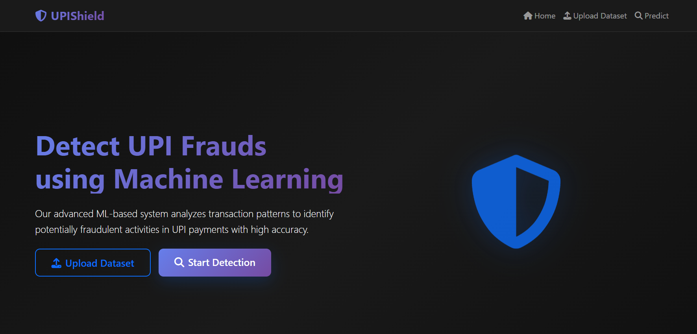
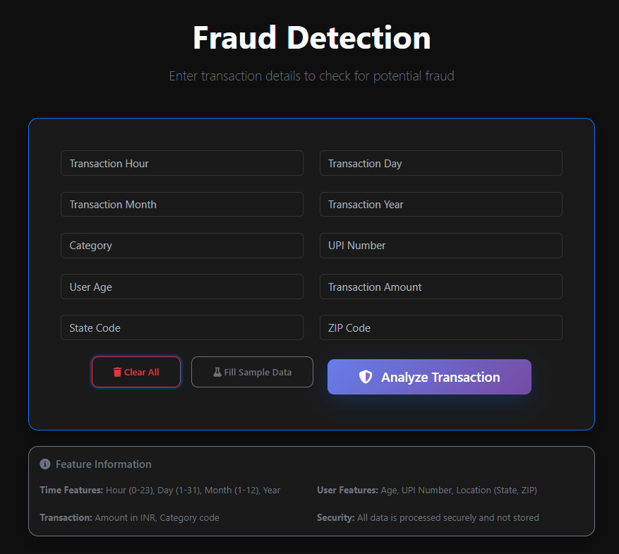
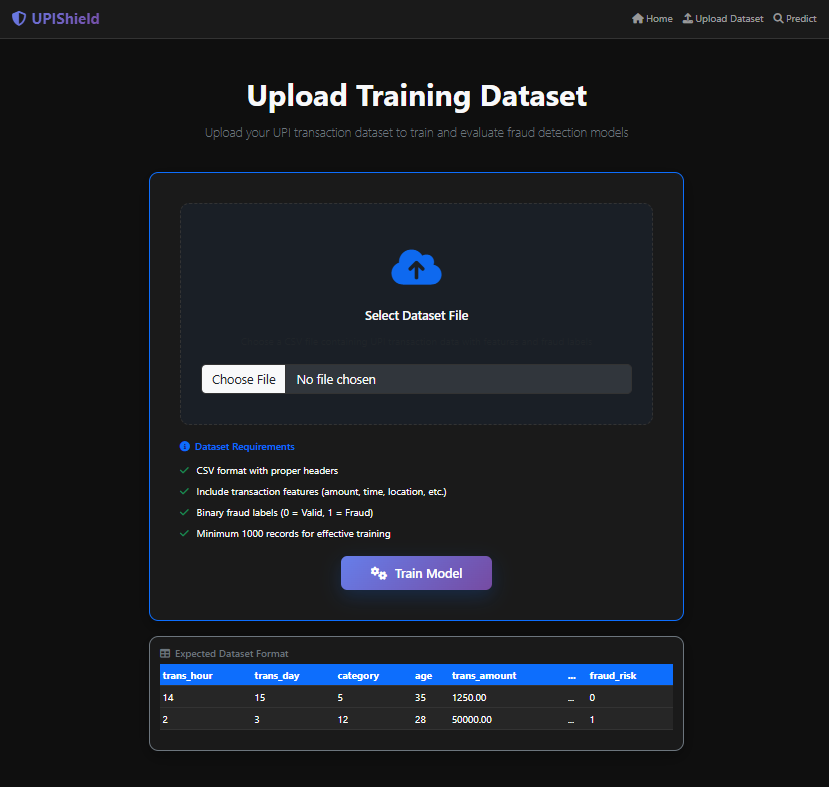

# UPIShield - UPI Fraud Detection System

## Overview

UPIShield is a machine learning-based fraud detection system specifically designed to identify potentially fraudulent UPI (Unified Payments Interface) transactions. The application provides a web interface for users to either input individual transaction features for real-time fraud detection or upload entire datasets for model training and evaluation. The system uses pre-trained machine learning models to analyze transaction patterns and classify them as fraudulent or legitimate, helping users identify suspicious activities in UPI payment systems.

## User Preferences

Preferred communication style: Simple, everyday language.

## System Architecture

### Frontend Architecture
The application uses a Flask-based web framework with a template-driven architecture. The frontend consists of multiple HTML templates that extend a base template for consistency, including:
# **Home page**: Provides system overview and navigation to main features

# **Prediction page**: Allows users to input transaction features for fraud detection

# **Upload page**: Enables dataset upload for model training

# **Results page**: Displays prediction outcomes, model performance metrics, and visualizations
  

The UI is built with Bootstrap 5 for responsive design and includes Font Awesome icons for enhanced user experience. Custom CSS provides a dark theme optimized for data analysis workflows.

### Backend Architecture
The Flask application follows a modular structure with the following key components:
- **Main application file (app.py)**: Contains route handlers, model loading logic, and prediction functionality
- **Model management**: Handles loading of pre-trained models, scalers, and performance metrics from disk
- **File processing**: Manages CSV dataset uploads and data preprocessing for training
- **Visualization**: Generates matplotlib plots for model performance and converts them to base64 for web display

The system supports multiple machine learning models including Random Forest, Gradient Boosting, Logistic Regression, SVM, and Neural Networks, with model artifacts stored as joblib files.

### Data Processing Pipeline
The application implements a complete data processing workflow:
- **Feature extraction**: Accepts 10 numerical features representing transaction characteristics
- **Data preprocessing**: Uses saved scaler objects to normalize input features
- **Model inference**: Applies trained models to predict fraud probability
- **Batch processing**: Supports CSV file uploads for bulk analysis and model retraining

### Model Persistence and Artifacts
The system maintains several types of persistent artifacts:
- **Trained models**: Stored as .h5 or joblib files in the models directory
- **Feature scalers**: Joblib-serialized preprocessing objects for consistent data normalization
- **Performance metrics**: JSON files containing model accuracy scores across different algorithms
- **Visualization assets**: Generated plots saved as PNG files and converted to base64 for web display

## External Dependencies

### Core Framework Dependencies
- **Flask**: Web application framework for handling HTTP requests and rendering templates
- **NumPy**: Numerical computing library for array operations and mathematical functions
- **Pandas**: Data manipulation and analysis library for handling CSV files and dataframes
- **Scikit-learn**: Machine learning library providing algorithms, preprocessing tools, and model evaluation metrics
- **Joblib**: Efficient serialization library for saving and loading machine learning models

### Visualization and UI Dependencies
- **Matplotlib**: Plotting library for generating model performance charts and accuracy visualizations
- **Bootstrap 5**: CSS framework for responsive web design and UI components
- **Font Awesome**: Icon library for enhanced user interface elements

### Model Storage
The application relies on local file system storage for:
- Pre-trained model files (Random Forest, Gradient Boosting, Logistic Regression, SVM, Neural Network)
- Feature scaling objects for data preprocessing consistency
- Performance metrics and accuracy scores in JSON format
- Generated visualization plots for model evaluation

No external databases or cloud services are currently integrated, with all data persistence handled through local file storage.

# Steps to run application:
1. python -m venv venv        
   venv\Scripts\activate
         or
   conda create --name sign python=3.7.1
   conda activate sign
   
3. pip install -r requirements.txt
4. python create_models.py 
5. python main.py       

