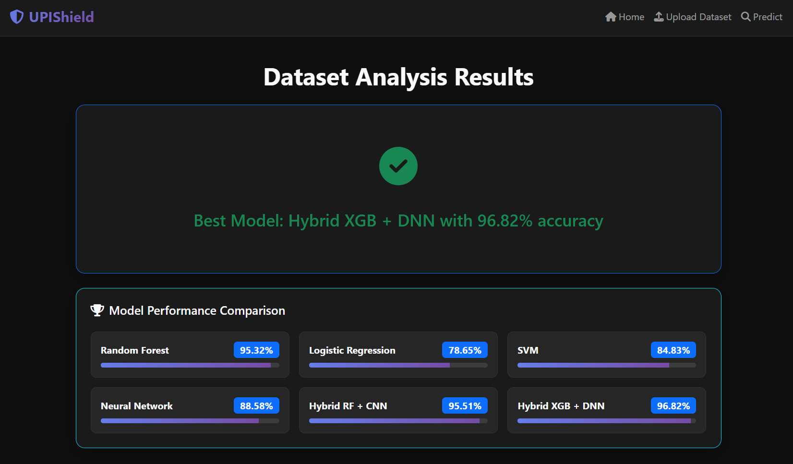
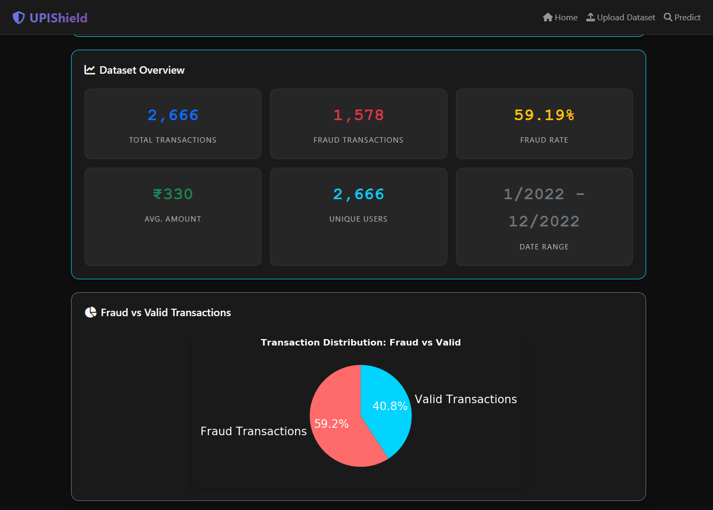
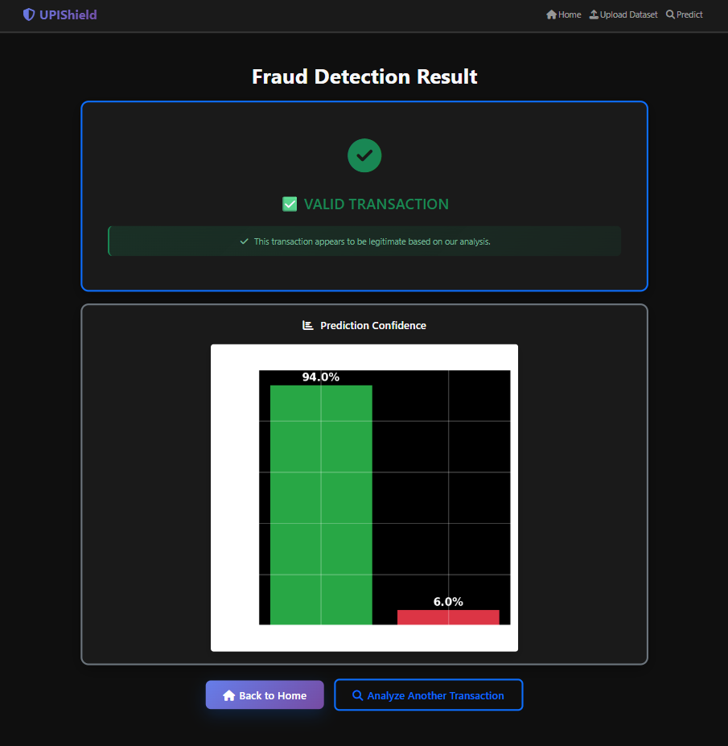

# UPIShield - UPI Fraud Detection System

## Overview

UPIShield is a machine learning and deep learning–based fraud detection system designed to identify potentially fraudulent UPI (Unified Payments Interface) transactions.

The system provides:

- **Fraud detection**: Users can input transaction details and get instant predictions.
- **Batch analysis**: Upload CSV datasets for fraud detection on multiple transactions at once.
- **Hybrid AI models**: Combines traditional ML with deep learning for enhanced accuracy.

The application uses pre-trained models, scalers, and hybrid architectures to analyze transaction patterns and classify them as **fraudulent** or **legitimate**, helping users detect suspicious UPI payment activities.

---

## System Architecture

### Frontend

The Flask web app provides an easy-to-use interface built with **Bootstrap 5** and **Font Awesome**, styled with a custom **dark theme** for data analysis workflows.

- **Home Page**: Overview and navigation  
    
  

- **Prediction Page**: Enter transaction features for real-time fraud prediction  
  

- **Upload Page**: Upload a dataset for fraud detection and retraining  
  

- **Results Page**: Shows predictions, model performance, and accuracy visualizations  
    
  

---

### Backend

The backend is powered by **Flask** with modular components:

- **`app.py`** – Runs the Flask server and handles user requests
- **`create_models.py`** – Trains models, evaluates them, and saves the **best model + scaler**
- **Model Management** – Loads saved models (`.pkl` or `.keras`) and scalers (`.joblib`)
- **File Processing** – Reads uploaded CSV files and preprocesses them
- **Visualization** – Generates accuracy plots with matplotlib

---

### Data Processing Pipeline

1. **Feature Extraction**: The system uses 10 numerical features (transaction hour, day, month, year, category, UPI number, age, amount, state, ZIP).
2. **Preprocessing**: Features are scaled using a saved **StandardScaler (`scaler.joblib`)**.
3. **Model Inference**: Multiple models are trained; the **best model is automatically saved** and used for predictions.
4. **Batch Processing**: Uploaded CSVs are processed and classified in bulk.

---

### Models Included

UPIShield supports multiple ML and hybrid DL models:

- **Random Forest**
- **Logistic Regression**
- **SVM**
- **MLP Neural Network (Sklearn)**
- **Hybrid Random Forest + CNN (Keras)**
- **Hybrid XGBoost + DNN (Keras)**

The system automatically selects and saves the **best performing model** during training.

---

### Model Persistence & Artifacts

All artifacts are stored in the `models/` directory:

- **Scaler**: `scaler.joblib` – ensures consistent preprocessing
- **Best Model**:
  - Saved as `project_model.pkl` (for sklearn/XGBoost models)
  - Saved as `project_model.keras` (for Keras deep learning models)
- **Scores**: `scores.json` – contains accuracy results for all trained models
- **Plots**: Generated with matplotlib and embedded in the UI

---

## External Dependencies

### Core Libraries

- **Flask** – Web framework
- **NumPy** – Numerical operations
- **Pandas** – Data handling
- **Scikit-learn** – ML models and preprocessing
- **XGBoost** – Gradient boosting model
- **TensorFlow/Keras** – Deep learning models
- **Joblib** – Model and scaler persistence

### Visualization & UI

- **Matplotlib** – Accuracy and performance plots
- **Bootstrap 5** – Responsive frontend
- **Font Awesome** – Icons

---

## Steps to Run Application

1. Create a virtual environment:

   ```bash
   python -m venv venv
   venv\Scripts\activate   # On Windows
   # OR
   conda create --name upishield python=3.9
   conda activate upishield


2. Install dependencies:
   ```bash
   pip install -r requirements.txt

3. Train and save models:
   ```bash
   python create_models.py
   ```
   This will:
   Train multiple models
   Save the scaler
   Save the best model (.pkl or .keras)
   Save accuracy results in scores.json

4. Run the Flask application:
   ```bash
   python app.py
   ```
   Open browser at:
   http://127.0.0.1:5000/

## 🔮 Prediction Example




